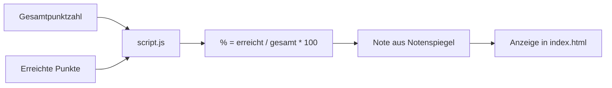
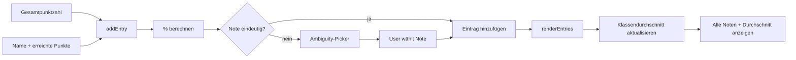

# Notenrechner — Architektur

## Übersicht

Eine statische Webapp bestehend aus HTML, CSS und JavaScript zur Berechnung
der Note aus Gesamtpunktzahl und erreichter Punktzahl, mit zwei Modi:
**Einzelberechnung** und **Klassendurchschnitt**.

## Komponenten

```
index.html       → Struktur (Eingabeformular, Ergebnisanzeige,
                   Notenspiegel-Tabelle, Klassenmodus)
style.css        → Layout & Design (responsiv, helles Theme, Mobile-First)
script.js        → Logik & Interaktion (Einzelberechnung, Klassenmodus,
                   CRUD-Operationen, Ambiguity-Handling, localStorage)
architecture.md  → Dieses Dokument
```

## Datenfluss

### Einzelberechnung



### Klassendurchschnitt



## Funktionsweise

### Einzelberechnung

1. **Eingabe:** Der Nutzer gibt die Gesamtpunktzahl und die erreichten Punkte
   in zwei `input[type=number]`-Felder ein.
2. **Berechnung:** Mit jedem `input`-Event wird die Berechnung sofort
   neu ausgelöst (automatische Aktualisierung).
3. **Prozentwert:** `(erreichtePunkte / gesamtPunkte) * 100`, auf 2
   Nachkommastellen gerundet, auf 0–100% begrenzt.
4. **Notenermittlung:** Der Prozentwert wird mit einer fest codierten
   Notentabelle (Notenspiegel) abgeglichen. Bei exakten `.5`-Grenzen
   werden beide möglichen Noten angezeigt (z. B. `2− / 2`).
5. **Persistenz:** Die eingegebenen Werte werden bei `change` in
   `localStorage` gespeichert und beim Laden der Seite wiederhergestellt.

### Klassendurchschnitt

1. **Gesamtpunktzahl:** Eine gemeinsame Gesamtpunktzahl für die gesamte Klasse.
2. **Schüler hinzufügen:** Name (optional) + erreichte Punkte eingeben und
   über "+" hinzufügen. Bei nicht eindeutiger Note (`.5`-Grenze) erscheint
   ein Ambiguity-Picker zur Auswahl.
3. **Liste:** Alle Einträge werden in einer scrollbaren Liste angezeigt mit
   Name, Punkten, Prozent und Note.
4. **Bearbeiten/Löschen:** Jeder Eintrag kann bearbeitet (✎) oder gelöscht (✕)
   werden. Beim Bearbeiten werden die Felder inline editierbar; bei
   nicht eindeutiger Note erscheint erneut der Ambiguity-Picker.
5. **Durchschnitt:** Der Klassendurchschnitt wird aus den Einzelnoten
   (umgerechnet in Zahlenwerte 1.0–6.0) berechnet und als Note mit
   numerischem Wert angezeigt. Aktualisiert nach jeder Änderung.
6. **Persistenz:** Alle Einträge + Gesamtpunktzahl + aktiver Modus werden
   in `localStorage` gespeichert.

### Notenspiegel

Die fest codierte Notentabelle (`GRADE_SCALE`) definiert 13 Notenstufen
von 1 (99–100%) bis 6 (0–25%). Der Notenspiegel wird dynamisch als HTML-
Tabelle gerendert.

#### Notenumrechnung für den Durchschnitt

| Note | Zahlenwert |
|------|-----------:|
| 1    | 1.0        |
| 1−   | 1.3        |
| 2+   | 1.7        |
| 2    | 2.0        |
| 2−   | 2.3        |
| 3+   | 2.7        |
| 3    | 3.0        |
| 3−   | 3.3        |
| 4+   | 3.7        |
| 4    | 4.0        |
| 4−   | 4.3        |
| 5    | 5.0        |
| 6    | 6.0        |

### Ambiguity-Handling

Wenn der errechnete Prozentwert exakt auf einer `.5`-Grenze liegt
(z. B. 85.5%), wird die Note als nicht eindeutig erkannt. Der Nutzer
muss dann im Ambiguity-Picker eine der beiden möglichen Noten auswählen,
bevor der Eintrag gespeichert wird.

## Notenspiegel

| Note | Prozentbereich |
|------|----------------|
| 1    | 100–99%       |
| 1−   | 98–97%        |
| 2+   | 96–95%        |
| 2    | 94–86%        |
| 2−   | 85–84%        |
| 3+   | 83–82%        |
| 3    | 81–70%        |
| 3−   | 69–68%        |
| 4+   | 67–66%        |
| 4    | 65–52%        |
| 4−   | 51–50%        |
| 5    | 49–26%        |
| 6    | 25–0%         |
