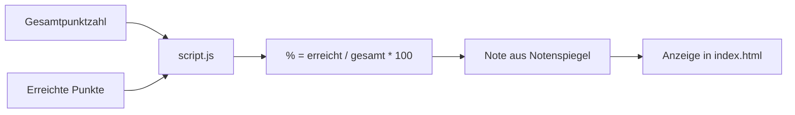

# Notenrechner — Architektur

## Übersicht

Eine statische Webapp bestehend aus HTML, CSS und JavaScript zur Berechnung
der Note aus Gesamtpunktzahl und erreichter Punktzahl.

## Komponenten

```
index.html       → Struktur (Eingabeformular, Ergebnisanzeige, Notenspiegel-Bild)
style.css        → Layout & Design (responsiv, helles Theme)
script.js        → Logik & Interaktion
Notenspiegel.jpeg → Referenzgrafiken für den Notenspiegel
architecture.md  → Dieses Dokument
```

## Datenfluss



## Funktionsweise

1. **Eingabe:** Der Nutzer gibt die Gesamtpunktzahl und die erreichten Punkte
   in zwei `input[type=number]`-Felder ein.
2. **Berechnung:** Mit jedem `input`-Event wird die Berechnung sofort
   neu ausgelöst (automatische Aktualisierung).
3. **Prozentwert:** `(erreichtePunkte / gesamtPunkte) * 100`, auf 2
   Nachkommastellen gerundet, auf 0–100% begrenzt.
4. **Notenermittlung:** Der Prozentwert wird mit einer fest codierten
   Notentabelle (Notenspiegel) abgeglichen.
5. **Persistenz:** Die eingegebenen Werte werden bei `change` in
   `localStorage` gespeichert und beim Laden der Seite wiederhergestellt.

## Notenspiegel (aus Notenspiegel.jpeg)

| Note | Prozentbereich |
|------|----------------|
| 1    | 100–99%       |
| 1−   | 98–97%        |
| 2+   | 96–95%        |
| 2    | 94–86%        |
| 2−   | 85–84%        |
| 3+   | 83–82%        |
| 3    | 81–70%        |
| 3−   | 69–68%        |
| 4+   | 67–66%        |
| 4    | 65–52%        |
| 4−   | 51–50%        |
| 5    | 49–26%        |
| 6    | 25–0%         |
